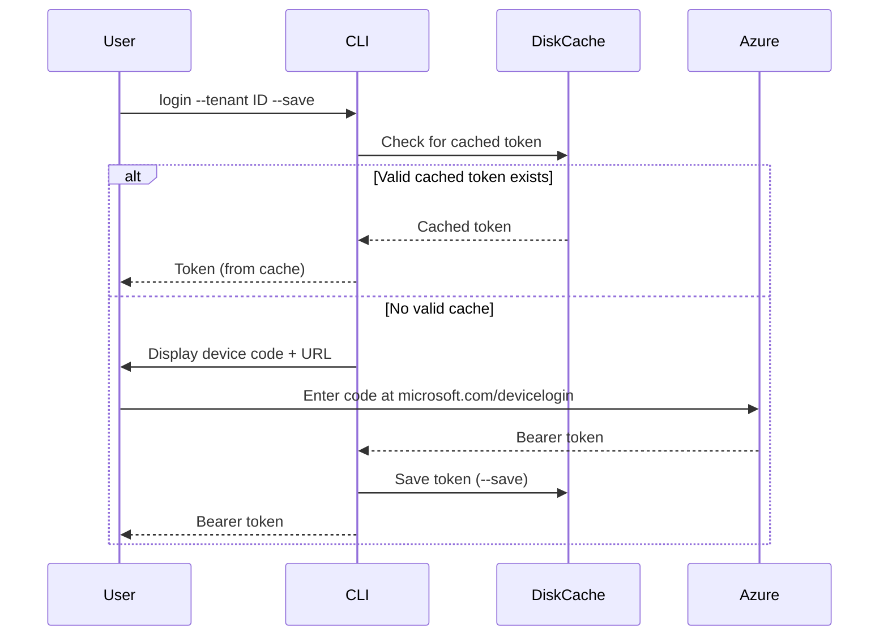
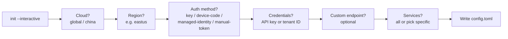
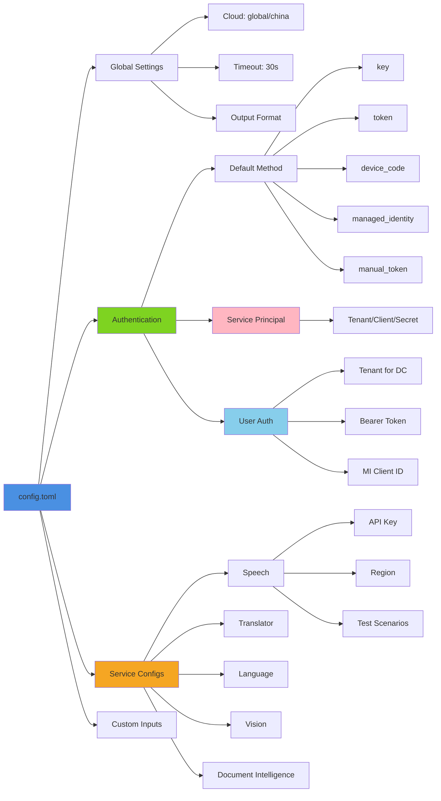
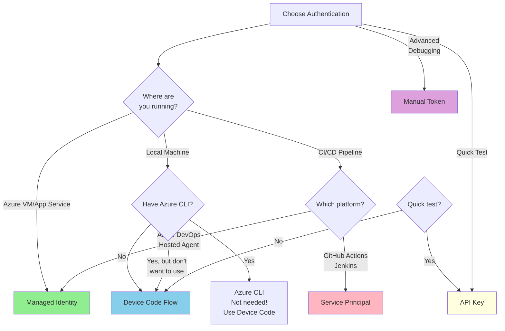

# Usage Guide

This guide provides detailed instructions for using Azure AI Tools Connect to verify connectivity to Azure AI Services.

## Table of Contents

- [Getting Started](#getting-started)
- [Commands](#commands)
  - [test](#test-command)
  - [login](#login-command)
  - [diagnose](#diagnose-command)
  - [init](#init-command)
  - [validate](#validate-command)
  - [list-scenarios](#list-scenarios-command)
- [Configuration](#configuration)
- [Authentication](#authentication)
- [Working with Services](#working-with-services)
- [Output Formats](#output-formats)
- [Troubleshooting](#troubleshooting)
- [Examples](#examples)

---

## Getting Started

### Step 1: Create a Configuration File

```bash
# Interactive wizard (recommended)
azure-aitoolsconnect init --interactive --output config.toml

# Or create a template to edit manually
azure-aitoolsconnect init --output config.toml
```

The interactive wizard walks you through cloud, region, auth method, and services.

### Step 2: Configure Your API Keys

Edit `config.toml` and add your Azure AI service credentials:

```toml
[services.speech]
enabled = true
region = "eastus"
api_key = "your-speech-api-key"
```

Or use environment variables:

```bash
export AZURE_AI_API_KEY="your-api-key"
export AZURE_REGION="eastus"
```

### Step 3: Run Your First Test

```bash
# With API key
azure-aitoolsconnect test --services speech --config config.toml

# Or with device code auth (no API key needed)
azure-aitoolsconnect test --services speech \
  --auth device-code --tenant YOUR_TENANT_ID \
  --endpoint https://your-resource.cognitiveservices.azure.com
```

---

## Commands

### test Command

Run connectivity tests against Azure AI Services.

```bash
azure-aitoolsconnect test [OPTIONS]
```

#### Options

| Option | Short | Description | Default |
|--------|-------|-------------|---------|
| `--services <LIST>` | `-s` | Services to test (comma-separated or "all") | all |
| `--api-key <KEY>` | `-k` | API key for authentication | - |
| `--auth <METHOD>` | `-a` | Auth method (key/device-code/managed-identity/manual-token/token/both) | key |
| `--region <REGION>` | `-r` | Azure region | eastus |
| `--cloud <CLOUD>` | `-c` | Cloud environment (global/china) | global |
| `--tenant <ID>` | | Tenant ID for device code flow | - |
| `--bearer-token <TOKEN>` | | Bearer token for manual-token auth | - |
| `--endpoint <URL>` | `-e` | Custom endpoint URL | - |
| `--output <FORMAT>` | `-o` | Output format (human/json/junit) | human |
| `--output-file <FILE>` | `-f` | Write output to file | - |
| `--timeout <SECONDS>` | `-t` | Request timeout | 30 |
| `--scenario <ID>` | | Run specific scenario | - |
| `--input-file <PATH>` | `-i` | Input file for tests (audio/image/document) | - |
| `--show-token` | | Display the bearer token on stderr after authentication | false |
| `--no-cache` | | Skip reading cached tokens from disk | false |
| `--verbose` | `-v` | Show detailed output | false |
| `--quiet` | `-q` | Suppress progress indicators | false |

#### Examples

```bash
# Test all services with API key
azure-aitoolsconnect test --services all --api-key $KEY --region eastus

# Test with device code auth and display the token
azure-aitoolsconnect test --services speech \
  --auth device-code --tenant YOUR_TENANT_ID \
  --endpoint https://your-resource.cognitiveservices.azure.com \
  --show-token

# Test specific services
azure-aitoolsconnect test --services speech,translator --api-key $KEY

# Run a specific scenario
azure-aitoolsconnect test --services speech --scenario voices_list

# Test with input file (for speech-to-text)
azure-aitoolsconnect test --services speech --scenario stt_short \
  --input-file ./audio.wav

# Output to JSON file
azure-aitoolsconnect test --services all --output json \
  --output-file results.json

# Use custom endpoint with bearer token
azure-aitoolsconnect test --services speech \
  --auth manual-token --bearer-token $TOKEN \
  --endpoint https://my-custom-endpoint.cognitiveservices.azure.com

# Force fresh authentication (ignore cached tokens)
azure-aitoolsconnect test --auth device-code --tenant $TENANT --no-cache
```

---

### login Command

Get a bearer token interactively without running tests. Useful for support engineers who need tokens for other tools (curl, Postman, etc.).

```bash
azure-aitoolsconnect login [OPTIONS]
```

#### Options

| Option | Description | Default |
|--------|-------------|---------|
| `--tenant <ID>` | Tenant ID (required for device-code) | - |
| `--auth <METHOD>` | Auth method (device-code/managed-identity) | device-code |
| `--cloud <CLOUD>` | Cloud environment (global/china) | global |
| `--client-id <ID>` | Custom OAuth client ID | Azure CLI client ID |
| `--output <FORMAT>` | Output format (human/json) | human |
| `--save` | Cache the token to disk for subsequent commands | false |
| `--clear-cache` | Clear all cached tokens and exit | false |

#### Token Caching Flow



#### Examples

```bash
# Get a token interactively (device code flow)
azure-aitoolsconnect login --tenant YOUR_TENANT_ID

# Get a token and save it to disk cache
azure-aitoolsconnect login --tenant YOUR_TENANT_ID --save

# Get token as JSON (for scripting)
azure-aitoolsconnect login --tenant YOUR_TENANT_ID --output json

# Get token via managed identity (on Azure)
azure-aitoolsconnect login --auth managed-identity

# Clear all cached tokens
azure-aitoolsconnect login --clear-cache
```

#### Interactive Device Code Flow

```
======================================================================
  [*] Azure Authentication Required
======================================================================

  1. Open this URL in your browser:
     https://microsoft.com/devicelogin

  2. Enter this code:  ABCD1234

======================================================================
  > Waiting for sign-in... [=============>------] 12:34 remaining

  [+] Authentication successful!

Bearer Token (expires in ~59 minutes):
eyJhbGciOiJSUzI1NiIsInR5cCI6IkpXVCJ9...
```

#### JSON Output

```bash
$ azure-aitoolsconnect login --tenant $TENANT --output json
```

```json
{
  "access_token": "eyJhbGciOiJSUzI1NiIs...",
  "expires_in_minutes": 59
}
```

---

### diagnose Command

Run network diagnostics to troubleshoot connectivity issues.

```bash
azure-aitoolsconnect diagnose [OPTIONS]
```

#### Options

| Option | Description |
|--------|-------------|
| `--dns` | Check DNS resolution for Azure endpoints |
| `--tls` | Validate TLS/HTTPS connectivity |
| `--latency` | Measure network latency |
| `--region <REGION>` | Target region to diagnose |
| `--cloud <CLOUD>` | Cloud environment |

#### Examples

```bash
# Run all diagnostics
azure-aitoolsconnect diagnose --dns --tls --latency --region eastus

# DNS resolution only
azure-aitoolsconnect diagnose --dns --region westus2

# Check TLS for Azure China
azure-aitoolsconnect diagnose --tls --cloud china --region chinaeast2
```

#### Diagnostic Output

```
DNS Resolution
──────────────
✓ eastus.api.cognitive.microsoft.com → 52.168.112.66 (45ms)
✓ api.cognitive.microsofttranslator.com → 40.90.137.124 (38ms)

TLS Handshake
─────────────
✓ eastus.api.cognitive.microsoft.com:443 - TLS 1.3 (52ms)
✓ api.cognitive.microsofttranslator.com:443 - TLS 1.3 (41ms)

Latency
───────
eastus.api.cognitive.microsoft.com: avg 45ms, min 42ms, max 51ms
```

---

### init Command

Initialize a new configuration file. Use `--interactive` for a guided wizard that asks about your cloud, region, auth method, and services.

```bash
azure-aitoolsconnect init [OPTIONS]
```

#### Options

| Option | Short | Description |
|--------|-------|-------------|
| `--output <FILE>` | | Output file path (default: config.toml) |
| `--force` | | Overwrite existing file |
| `--interactive` | `-i` | Launch interactive configuration wizard |

#### Interactive Wizard Flow



#### Examples

```bash
# Interactive wizard (recommended for first-time setup)
azure-aitoolsconnect init --interactive

# Create default config template
azure-aitoolsconnect init

# Create config at specific path
azure-aitoolsconnect init --output ./my-config.toml

# Overwrite existing config
azure-aitoolsconnect init --output config.toml --force
```

---

### validate Command

Validate your configuration file for errors and missing values.

```bash
azure-aitoolsconnect validate [OPTIONS]
```

#### Options

| Option | Description |
|--------|-------------|
| `--config <FILE>` | Configuration file to validate |

#### Examples

```bash
# Validate default config
azure-aitoolsconnect validate

# Validate specific config
azure-aitoolsconnect validate --config ./production.toml
```

#### Validation Output

```
Configuration Summary
─────────────────────
Cloud: global
Region: eastus
Timeout: 30s
Auth Method: key

Services:
  ✓ speech - enabled (region: eastus)
  ✓ translator - enabled (region: global)
  ✗ language - missing API key
  ○ vision - disabled
  ○ document_intelligence - disabled

Warnings:
  - Language service is enabled but missing API key
  - Consider setting AZURE_LANGUAGE_API_KEY
```

---

### list-scenarios Command

List available test scenarios for services.

```bash
azure-aitoolsconnect list-scenarios [OPTIONS]
```

#### Options

| Option | Description |
|--------|-------------|
| `--service <NAME>` | Filter by service name |

#### Examples

```bash
# List all scenarios
azure-aitoolsconnect list-scenarios

# List scenarios for speech service
azure-aitoolsconnect list-scenarios --service speech
```

#### Output

```
Speech Service Scenarios
────────────────────────
  voices_list      - Retrieve available TTS voices
  token_exchange   - Exchange API key for cognitive token
  stt_short        - Speech-to-text (short audio) [requires: audio file]
  tts              - Text-to-speech synthesis

Translator Service Scenarios
────────────────────────────
  languages        - List supported languages
  detect           - Detect language of text
  translate        - Translate text between languages

Vision Service Scenarios
────────────────────────
  analyze_image    - Analyze image content [requires: image file]
  read_text        - Extract text from image (OCR) [requires: image file]
  detect_objects   - Detect objects in image [requires: image file]
```

---

## Configuration

### Configuration Structure Overview



### Configuration File (config.toml)

```toml
# Global settings
[global]
cloud = "global"              # Azure cloud: "global" or "china"
timeout_seconds = 30          # HTTP request timeout
output_format = "human"       # Output: "human", "json", "junit"

# Authentication settings
[auth]
default_method = "key"        # "key", "token", "device_code", "managed_identity", "manual_token", "both"

# Service principal configuration (for "token" method)
[auth.entra]
tenant_id = "your-tenant-id"
client_id = "your-service-principal-client-id"
client_secret = "your-service-principal-secret"

# User authentication (for device_code, managed_identity, manual_token)
[auth.user]
tenant_id = "your-tenant-id"              # Required for device_code
# client_id = "04b07795-8ddb-461a-bbee-02f9e1bf7b46"  # Optional
# managed_identity_client_id = "..."     # For user-assigned MI
# bearer_token = "eyJ0..."                # For manual token

# Service configurations
[services.speech]
enabled = true
region = "eastus"
api_key = "your-api-key"      # Or use AZURE_SPEECH_API_KEY env var
endpoint = ""                 # Optional: custom endpoint
test_scenarios = ["voices_list", "token_exchange"]

[services.translator]
enabled = true
api_key = "your-api-key"
test_scenarios = ["languages", "detect", "translate"]

[services.language]
enabled = true
region = "eastus"
api_key = "your-api-key"
test_scenarios = ["sentiment", "language_detection"]

[services.vision]
enabled = false               # Disabled by default

[services.document_intelligence]
enabled = false

# Input files for tests requiring data
[custom_inputs]
audio_file = "/path/to/sample.wav"
image_file = "/path/to/sample.png"
document_file = "/path/to/sample.pdf"
text = "Sample text for analysis"
```

### Environment Variables

Environment variables override configuration file values:

```bash
# Global settings
export AZURE_AI_API_KEY="your-default-api-key"
export AZURE_REGION="eastus"
export AZURE_CLOUD="global"

# Service-specific keys
export AZURE_SPEECH_API_KEY="speech-specific-key"
export AZURE_SPEECH_REGION="westus2"
export AZURE_TRANSLATOR_API_KEY="translator-key"
export AZURE_LANGUAGE_API_KEY="language-key"
export AZURE_VISION_API_KEY="vision-key"

# Service Principal (Entra ID) authentication
export AZURE_TENANT_ID="your-tenant-id"
export AZURE_CLIENT_ID="your-client-id"
export AZURE_CLIENT_SECRET="your-client-secret"

# User authentication (NEW)
export AZURE_USER_TENANT_ID="your-tenant-id"        # For device code flow
export AZURE_BEARER_TOKEN="eyJ0..."                  # For manual token
export AZURE_MI_CLIENT_ID="your-uami-client-id"      # For user-assigned MI

# Configuration file location
export AZURE_AITOOLSCONNECT_CONFIG="/path/to/config.toml"
```

### Priority Order

Configuration values are applied in this order (later overrides earlier):

1. Default values
2. Configuration file
3. Environment variables
4. CLI arguments

---

## Authentication

Azure AI Tools Connect supports multiple authentication methods to accommodate different scenarios:

### Authentication Method Decision Flow



### 1. API Key Authentication (Default)

**Best for:** Quick testing, local development, proof-of-concepts

The simplest method - uses the `Ocp-Apim-Subscription-Key` header.

```bash
# Via CLI
azure-aitoolsconnect test --api-key YOUR_KEY --region eastus

# Via environment
export AZURE_AI_API_KEY="YOUR_KEY"
azure-aitoolsconnect test --region eastus

# Via config file
[auth]
default_method = "key"

[services.speech]
api_key = "YOUR_KEY"
```

### 2. Device Code Flow (User Authentication)

**Best for:** Developers testing locally without Azure CLI, headless environments

**No Azure CLI required!** Device code flow displays a code for you to enter at microsoft.com/devicelogin.

```bash
# Via CLI (requires tenant ID)
azure-aitoolsconnect test \
  --auth device-code \
  --tenant YOUR_TENANT_ID \
  --region eastus

# Via environment variables
export AZURE_USER_TENANT_ID="your-tenant-id"
azure-aitoolsconnect test --auth device-code --region eastus

# Via config file
[auth]
default_method = "device_code"

[auth.user]
tenant_id = "your-tenant-id"
```

**Interactive Flow:**
```
======================================================================
  [*] Azure Authentication Required
======================================================================

  1. Open this URL in your browser:
     https://microsoft.com/devicelogin

  2. Enter this code:  ABCD1234

======================================================================
  > Waiting for sign-in... [=============>------] 12:34 remaining

  [+] Authentication successful!
```

You can also get a token standalone with the `login` command:
```bash
# Get token and cache it for subsequent test commands
azure-aitoolsconnect login --tenant YOUR_TENANT_ID --save

# Then run tests (uses cached token, no re-authentication)
azure-aitoolsconnect test --auth device-code --tenant YOUR_TENANT_ID \
  --endpoint https://your-resource.cognitiveservices.azure.com
```

### 3. Managed Identity (Azure Environments)

**Best for:** Azure VMs, App Service, Container Apps, Azure DevOps hosted agents

**Zero configuration** - automatically detected in Azure environments with managed identity enabled.

```bash
# System-assigned managed identity (auto-detected)
azure-aitoolsconnect test --auth managed-identity --region eastus

# User-assigned managed identity
export AZURE_MI_CLIENT_ID="your-uami-client-id"
azure-aitoolsconnect test --auth managed-identity --region eastus

# Via config file
[auth]
default_method = "managed_identity"

[auth.user]
managed_identity_client_id = "your-uami-client-id"  # optional
```

**Supported Azure Environments:**
- Azure Virtual Machines (IMDS)
- Azure App Service
- Azure Container Apps
- Azure Functions
- Azure DevOps hosted agents

### 4. Manual Token (Advanced)

**Best for:** Advanced troubleshooting, testing specific token scenarios

Provide your own bearer token obtained through any method.

```bash
# Via CLI
azure-aitoolsconnect test \
  --auth manual-token \
  --bearer-token "eyJ0..." \
  --region eastus

# Via environment
export AZURE_BEARER_TOKEN="eyJ0eXAiOiJKV1QiLCJhbG..."
azure-aitoolsconnect test --auth manual-token --region eastus

# Via config file
[auth]
default_method = "manual_token"

[auth.user]
bearer_token = "eyJ0eXAiOiJKV1QiLCJhbG..."
```

### 5. Service Principal (Entra ID)

**Best for:** Automation, CI/CD pipelines (GitHub Actions, Jenkins)

Enterprise-grade OAuth 2.0 authentication using Azure Entra ID (formerly Azure AD).

```bash
# Via environment
export AZURE_TENANT_ID="your-tenant-id"
export AZURE_CLIENT_ID="your-client-id"
export AZURE_CLIENT_SECRET="your-client-secret"
azure-aitoolsconnect test --auth token --region eastus

# Via config file
[auth]
default_method = "token"

[auth.entra]
tenant_id = "your-tenant-id"
client_id = "your-service-principal-client-id"
client_secret = "your-service-principal-secret"
```

### 6. Dual Authentication (Both)

Try both API key and service principal - useful for testing failover scenarios:

```bash
azure-aitoolsconnect test --auth both
```

### Authentication Method Comparison

| Method | Setup Complexity | Use Case | Azure CLI Required |
|--------|-----------------|----------|-------------------|
| **API Key** | Very Simple | Quick testing | No |
| **Device Code** | Simple | Local development | No |
| **Managed Identity** | Zero config | Azure environments | No |
| **Manual Token** | Medium | Advanced testing | No |
| **Service Principal** | Medium | Automation/CI/CD | No |

### Troubleshooting Authentication

The tool provides actionable hints with every error. For example:

```
Error: User authentication requires a tenant ID

Hint: Use --tenant YOUR_TENANT_ID or set AZURE_USER_TENANT_ID.
      Find your tenant ID: Azure Portal > Microsoft Entra ID > Overview
```

**Device Code Flow:**
- **Missing Tenant ID:** Use `--tenant` or set `AZURE_USER_TENANT_ID`
- **Timeout:** Run the command again and complete sign-in within the countdown timer
- **Need token for other tools:** Use `azure-aitoolsconnect login --tenant ID --save`

**Managed Identity:**
- **Not Available:** Ensure running on Azure resource with MI enabled, or use `--auth device-code`
- **Permission Denied:** Grant the managed identity **Cognitive Services User** role on the resource

**Manual Token:**
- **Invalid Token:** Ensure token is valid, not expired, and has correct audience/scope
- **Get a fresh token:** Use `azure-aitoolsconnect login --tenant ID` to acquire one

**Token Caching:**
- **Stale token:** Use `--no-cache` to force re-authentication
- **Clear all cached tokens:** `azure-aitoolsconnect login --clear-cache`

---

## Working with Services

### Speech Service

Test Azure Speech Services including text-to-speech and speech-to-text.

```bash
# List available voices
azure-aitoolsconnect test --services speech --scenario voices_list

# Test token exchange
azure-aitoolsconnect test --services speech --scenario token_exchange

# Speech-to-text (requires audio file)
azure-aitoolsconnect test --services speech --scenario stt_short \
  --input-file ./sample.wav

# Text-to-speech
azure-aitoolsconnect test --services speech --scenario tts
```

**Supported Audio Formats:** WAV, MP3, OGG, FLAC

### Translator Service

Test the Azure Translator service.

```bash
# List supported languages
azure-aitoolsconnect test --services translator --scenario languages

# Detect language
azure-aitoolsconnect test --services translator --scenario detect

# Translate text
azure-aitoolsconnect test --services translator --scenario translate
```

### Language Service

Test Azure Language services for text analytics.

```bash
# Sentiment analysis
azure-aitoolsconnect test --services language --scenario sentiment

# Detect language
azure-aitoolsconnect test --services language --scenario language_detection

# Named entity recognition
azure-aitoolsconnect test --services language --scenario entities

# Key phrase extraction
azure-aitoolsconnect test --services language --scenario key_phrases
```

### Vision Service

Test Azure Computer Vision services.

```bash
# Analyze image (requires image file)
azure-aitoolsconnect test --services vision --scenario analyze_image \
  --input-file ./sample.jpg

# OCR - extract text from image
azure-aitoolsconnect test --services vision --scenario read_text \
  --input-file ./document.png

# Object detection
azure-aitoolsconnect test --services vision --scenario detect_objects \
  --input-file ./photo.jpg
```

**Supported Image Formats:** PNG, JPEG, GIF, BMP, WEBP

### Document Intelligence Service

Test Azure Document Intelligence (Form Recognizer).

```bash
# Analyze document layout
azure-aitoolsconnect test --services document_intelligence --scenario layout \
  --input-file ./document.pdf

# Read document
azure-aitoolsconnect test --services document_intelligence --scenario read \
  --input-file ./invoice.pdf
```

**Supported Document Formats:** PDF, JPEG, PNG, BMP, TIFF

---

## Output Formats

### Human-Readable (Default)

Colorized console output with visual indicators:

```
Azure AI Services Connectivity Test
════════════════════════════════════

Speech Service
──────────────
  ✓ voices_list      - Retrieved 147 voices (342ms)
  ✓ token_exchange   - Token obtained successfully (156ms)
  ○ stt_short        - Skipped (no audio file)

Translator Service
──────────────────
  ✓ languages        - Retrieved 134 languages (98ms)
  ✓ detect           - Language detected: en (87ms)
  ✓ translate        - Translation successful (112ms)

Summary
───────
Total: 6 | Passed: 5 | Failed: 0 | Skipped: 1
Duration: 795ms
```

### JSON Output

Machine-readable JSON for automation:

```bash
azure-aitoolsconnect test --output json --output-file results.json
```

```json
{
  "timestamp": "2024-01-15T10:30:00Z",
  "summary": {
    "total": 6,
    "passed": 5,
    "failed": 0,
    "skipped": 1
  },
  "total_duration_ms": 795,
  "services": [
    {
      "name": "speech",
      "scenarios": [
        {
          "id": "voices_list",
          "status": "passed",
          "duration_ms": 342,
          "message": "Retrieved 147 voices"
        }
      ]
    }
  ]
}
```

### JUnit XML Output

For CI/CD integration (Jenkins, GitHub Actions, etc.):

```bash
azure-aitoolsconnect test --output junit --output-file results.xml
```

```xml
<?xml version="1.0" encoding="UTF-8"?>
<testsuites name="Azure AI Connectivity Tests" tests="6" failures="0" time="0.795">
  <testsuite name="speech" tests="3" failures="0" time="0.498">
    <testcase name="voices_list" time="0.342"/>
    <testcase name="token_exchange" time="0.156"/>
    <testcase name="stt_short">
      <skipped message="No audio file provided"/>
    </testcase>
  </testsuite>
</testsuites>
```

---

## Troubleshooting

### Common Issues

#### Authentication Errors (Exit Code 2)

```
Error: Authentication failed - Invalid API key
```

**Solutions:**
1. Verify your API key is correct
2. Check the key hasn't expired
3. Ensure the key has access to the target service
4. For Entra ID, verify tenant/client/secret values

#### Network Errors (Exit Code 3)

```
Error: Network error - Connection timed out
```

**Solutions:**
1. Run diagnostics: `azure-aitoolsconnect diagnose --dns --tls`
2. Check firewall rules allow outbound HTTPS (port 443)
3. Verify proxy settings if behind corporate firewall
4. Check Azure service status at https://status.azure.com

#### Configuration Errors (Exit Code 4)

```
Error: Configuration error - Invalid region
```

**Solutions:**
1. Validate config: `azure-aitoolsconnect validate --config config.toml`
2. Check region names match Azure region identifiers
3. Verify TOML syntax is correct

#### Input File Errors (Exit Code 5)

```
Error: Invalid input - Audio file not found
```

**Solutions:**
1. Verify the file path is correct
2. Check file permissions
3. Ensure file format is supported

### Diagnostic Steps

```bash
# 1. Validate configuration
azure-aitoolsconnect validate --config config.toml

# 2. Run network diagnostics
azure-aitoolsconnect diagnose --dns --tls --latency --region eastus

# 3. Test with verbose output
azure-aitoolsconnect test --services speech --verbose

# 4. Test single scenario
azure-aitoolsconnect test --services speech --scenario voices_list --verbose
```

### Verbose Output

Use `--verbose` for detailed debugging information:

```bash
azure-aitoolsconnect test --services speech --verbose
```

Shows:
- Full request URLs
- Request headers (keys masked)
- Response status codes
- Response times
- Error details

---

## Examples

### CI/CD Integration

#### GitHub Actions

```yaml
- name: Test Azure AI Connectivity
  run: |
    azure-aitoolsconnect test \
      --services all \
      --api-key ${{ secrets.AZURE_AI_KEY }} \
      --region eastus \
      --output junit \
      --output-file test-results.xml

- name: Publish Test Results
  uses: dorny/test-reporter@v1
  with:
    name: Azure AI Connectivity
    path: test-results.xml
    reporter: java-junit
```

#### Azure DevOps

```yaml
- script: |
    azure-aitoolsconnect test \
      --services all \
      --api-key $(AZURE_AI_KEY) \
      --output junit \
      --output-file $(System.DefaultWorkingDirectory)/results.xml
  displayName: 'Test Azure AI Connectivity'

- task: PublishTestResults@2
  inputs:
    testResultsFormat: 'JUnit'
    testResultsFiles: '**/results.xml'
```

### Multi-Region Testing

```bash
#!/bin/bash
REGIONS=("eastus" "westus2" "westeurope" "eastasia")
API_KEY="your-api-key"

for region in "${REGIONS[@]}"; do
  echo "Testing $region..."
  azure-aitoolsconnect test \
    --services speech,translator \
    --api-key $API_KEY \
    --region $region \
    --output json \
    --output-file "results-${region}.json"
done
```

### Pre-Deployment Validation

```bash
#!/bin/bash
set -e

echo "Validating Azure AI connectivity before deployment..."

# Run connectivity tests
azure-aitoolsconnect test \
  --services all \
  --config production.toml \
  --output json \
  --output-file connectivity-report.json

# Check exit code
if [ $? -eq 0 ]; then
  echo "All connectivity tests passed!"
  exit 0
else
  echo "Connectivity tests failed. Aborting deployment."
  exit 1
fi
```

### Azure China (Mooncake)

```bash
# Test connectivity to Azure China
azure-aitoolsconnect test \
  --services speech,translator \
  --cloud china \
  --region chinaeast2 \
  --api-key $AZURE_CHINA_KEY
```

---

## Getting Help

```bash
# General help
azure-aitoolsconnect --help

# Command-specific help
azure-aitoolsconnect test --help
azure-aitoolsconnect diagnose --help
```

For issues and feature requests, please visit our [GitHub repository](https://github.com/enu235/azure-aitoolsconnect/issues).
